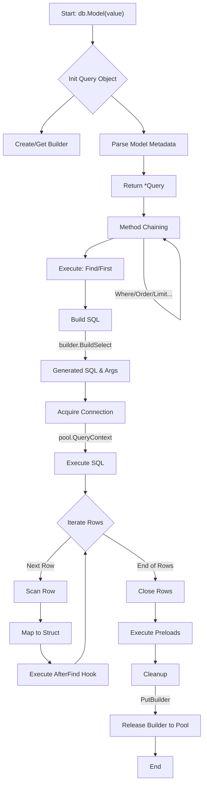

# JORM 查询过程详解

本文档详细描述了 JORM 中 `db.Model()` 对象从创建、链式调用、SQL 构建、执行查询、结果映射到最终销毁的完整生命周期。

## 流程概览 (Flowchart)

## 详细步骤

### 1. 初始化阶段 (Initialization)

当调用 `db.Model(&User{})` 时，JORM 初始化一个轻量级的 `Query` 对象。

*   **入口**: `core/db.go` 中的 `Model` 方法。
*   **动作**:
    1.  **创建 Builder**: 从 `sync.Pool` 中获取或创建一个新的 `Builder` (具体为 `sqlBuilder`)。
    2.  **创建 Query**: 实例化 `Query` 结构体，绑定当前的 `DB` 实例、`Executor` (连接池或事务对象) 和 `Builder`。
    3.  **解析模型**: 调用 `model.GetModel` 解析传入的结构体，获取表名、字段映射、Hook 标记等元数据。
    4.  **设置表名**: 将 `Builder` 的目标表名设置为模型对应的表名。

### 2. 构建阶段 (Construction)

用户通过链式调用方法（如 `.Where()`, `.Order()`, `.Limit()`）来构造查询条件。

*   **动作**:
    *   每次调用这些方法（如 `q.Where("id > ?", 1)`），都会直接修改内部 `Builder` 的状态。
    *   `Query` 对象本身在链式调用中被传递（通常返回 `*Query`），保持上下文。

### 3. 执行阶段 (Execution)

当调用终结方法（如 `.Find()`, `.First()`, `.Count()`）时，查询真正被执行。

*   **SQL 生成**:
    *   调用 `q.builder.BuildSelect()`。
    *   `Builder` 将所有累积的条件（Select列, Where条件, Order By等）拼接成最终的 SQL 字符串。
    *   **优化**: 使用 `strings.Builder` 进行零内存分配的字符串拼接。
    *   生成参数列表 `args`。

*   **获取连接与执行**:
    *   调用 `q.executor.QueryContext(ctx, sqlStr, args...)`。
    *   底层 `database/sql` 从连接池中借出一个连接（Session）。
    *   发送 SQL 到数据库执行，返回 `*sql.Rows`。

### 4. 扫描与映射阶段 (Scanning & Mapping)

JORM 遍历数据库返回的结果集，并将其映射回 Go 结构体。

*   **遍历**: `rows.Next()` 循环。
*   **扫描计划 (Scan Plan)**:
    *   首次扫描时，根据结果集列名和模型字段生成 `scanPlan`。
    *   `scanPlan` 缓存了列索引到结构体字段的映射关系，避免重复计算。
*   **行扫描**:
    *   创建新的结构体实例（如果是 `Find` 切片）或使用传入的实例（如果是 `First`）。
    *   `scanRowWithPlan` 利用反射将数据库值填充到结构体字段。
    *   自动处理类型转换（如 `[]byte` 转 `string`，`sql.NullString` 转 `string`）。
    *   **Hook**: 检查 `m.HasAfterFind` 标记，如果存在，调用 `AfterFind` Hook。

### 5. 关联加载 (Preloading)

如果用户使用了 `.Preload()`, 在主查询完成后执行。

*   **动作**:
    *   根据主查询结果收集外键 ID。
    *   发起额外的查询加载关联数据。
    *   将关联数据填充到主对象的相应字段。

### 6. 销毁与资源释放 (Finalization)

查询结束后的清理工作。

*   **关闭游标**: `defer rows.Close()` 确保数据库连接被归还到连接池。
*   **回收 Builder**: `defer PutBuilder(q.builder)` 将 `Builder` 对象重置并放回 `sync.Pool`，供后续查询复用。这是减少内存分配的关键优化。
*   **Query 对象**: `Query` 对象本身通常是栈上分配或逃逸分析后的小对象，由 Go GC 处理（未来可能引入 Query 对象池）。

## 核心代码引用

*   **初始化**: [db.go:Model](file:///Users/up/projects/jorm/core/db.go#L180) -> [db.go:newQuery](file:///Users/up/projects/jorm/core/db.go#L168)
*   **SQL 构建**: [builder.go:BuildSelect](file:///Users/up/projects/jorm/core/builder.go#L281)
*   **执行与资源回收**: [query.go:Find](file:///Users/up/projects/jorm/core/query.go#L289) (注意 `defer PutBuilder`)
*   **行扫描**: [query.go:scanRow](file:///Users/up/projects/jorm/core/query.go#L494)
